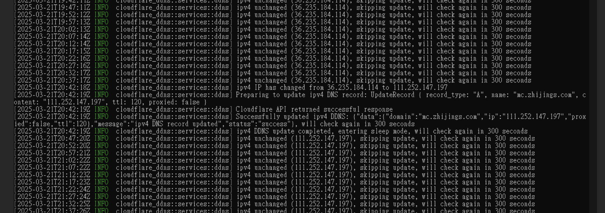

# Rust DDNS Updater

[](LICENSE)

A high-performance DDNS update tool written in Rust, supporting both IPv4 and IPv6.



## Features

- Support for IPv4 and IPv6 dual-stack updates
- Using Cloudflare API to update DNS records
- Web API interface for manual updates
- Automatic detection of IP changes and DNS record updates
- Multiple configuration methods (environment variables or configuration files)
- Detailed logging
- Lightweight and efficient implementation

## Quick Start

### Installation

1. Make sure Rust and Cargo are installed:
   ```
   curl --proto '=https' --tlsv1.2 -sSf https://sh.rustup.rs | sh
   ```

2. Clone this repository:
   ```
   git clone https://github.com/love2004/Rust-DDNS-Updater.git
   cd Rust-DDNS-Updater
   ```

3. Compile the program:
   ```
   cargo build --release
   ```

### Configuration

There are two ways to configure DDNS updates:

#### Using Environment Variables

1. Copy the example environment variable file:
   ```
   cp .env.example .env
   ```

2. Edit the `.env` file and fill in your Cloudflare API information

#### Using Configuration File

1. Copy the example configuration file:
   ```
   cp config/ddns.example.json config/ddns.json
   ```

2. Edit the `config/ddns.json` file and fill in your Cloudflare API information

3. Set in the `.env` file:
   ```
   DDNS_CONFIG_FILE=config/ddns.json
   ```

#### Server Settings

Server settings are stored in the `config/default.toml` file:

```toml
[server]
host = "0.0.0.0"  # Listen address
port = 8080       # Listen port
```

You can modify these settings as needed.

### Running

#### Running as a Service

Run the following command to start the DDNS update service and Web API:

```
cargo run --release
```

Or run the compiled executable directly:

```
./target/release/iploolup
```

#### Running DDNS Update Service Only

```
RUN_MODE=ddns cargo run --release
```

Or:

```
RUST_LOG=info RUN_MODE=ddns ./target/release/iploolup
```

### Using Web API

After starting, the following API endpoints are available:

- Show API information: `GET http://localhost:8080/api/v1/`
- Get current IPv4: `GET http://localhost:8080/api/v1/ip/v4`
- Get current IPv6: `GET http://localhost:8080/api/v1/ip/v6`
- Manually update IPv4 DNS record: `GET http://localhost:8080/api/v1/ddns/update/ipv4`
- Manually update IPv6 DNS record: `GET http://localhost:8080/api/v1/ddns/update/ipv6`
- Update IPv4 DNS record (backwards compatibility): `GET http://localhost:8080/api/v1/ddns/update`

#### API Response Examples

Here are the response formats for each API endpoint:

##### API Root Endpoint (`/api/v1/`)

```json
{
    "status": "success",
    "message": "IP Lookup API",
    "version": "1.0.0",
    "endpoints": {
        "ipv4": "/api/v1/ip/v4",
        "ipv6": "/api/v1/ip/v6",
        "ddns": {
            "ipv4": "/api/v1/ddns/update/ipv4",
            "ipv6": "/api/v1/ddns/update/ipv6"
        }
    }
}
```

##### Get IP (`/api/v1/ip/v4` or `/api/v1/ip/v6`)

```json
{
    "status": "success",
    "data": {
        "ip": "203.0.113.1"  # or IPv6 address
    }
}
```

##### Update DNS Record (`/api/v1/ddns/update/ipv4` or `/api/v1/ddns/update/ipv6`)

```json
{
    "status": "success",
    "message": "DNS record updated",
    "data": {
        "ip": "203.0.113.1",  # or IPv6 address
        "domain": "example.com",
        "ttl": 120,
        "proxied": false
    }
}
```

## Configuration Options

### Environment Variables

| Environment Variable | Description | Default Value |
|----------|------|--------|
| `DDNS_CONFIG_FILE` | Configuration file path | - |
| `CLOUDFLARE_API_TOKEN` | Cloudflare API token | - |
| `CLOUDFLARE_ZONE_ID` | Cloudflare zone ID | - |
| `CLOUDFLARE_RECORD_ID` | IPv4 DNS record ID | - |
| `CLOUDFLARE_RECORD_NAME` | IPv4 DNS record name | - |
| `CLOUDFLARE_API_TOKEN_V6` | IPv6 specific API token (optional) | Same as IPv4 |
| `CLOUDFLARE_ZONE_ID_V6` | IPv6 specific zone ID (optional) | Same as IPv4 |
| `CLOUDFLARE_RECORD_ID_V6` | IPv6 DNS record ID | - |
| `CLOUDFLARE_RECORD_NAME_V6` | IPv6 DNS record name | - |
| `DDNS_UPDATE_INTERVAL` | Update interval (seconds) | 300 |
| `DDNS_UPDATE_INTERVAL_V6` | IPv6 update interval (seconds) | Same as IPv4 |
| `RUN_MODE` | Run mode (web or ddns) | web |
| `RUST_LOG` | Log level (trace, debug, info, warn, error) | info |

### Configuration File Format

Configuration file uses JSON format:

```json
[
  {
    "api_token": "your_cloudflare_api_token",
    "zone_id": "your_cloudflare_zone_id",
    "record_id": "your_cloudflare_record_id",
    "record_name": "example.com",
    "update_interval": 300,
    "ip_type": "ipv4"
  },
  {
    "api_token": "your_cloudflare_api_token_for_ipv6",
    "zone_id": "your_cloudflare_zone_id_for_ipv6",
    "record_id": "your_cloudflare_record_id_for_ipv6",
    "record_name": "example.com",
    "update_interval": 300,
    "ip_type": "ipv6"
  }
]
```

## Security Considerations

- Your Cloudflare API token has permissions to modify DNS records, keep it secure
- It's recommended to use API tokens with limited permissions, only granting necessary access
- If used on public networks, consider adding authentication for the Web API

## Contributing

Issues and Pull Requests are welcome!

## License

MIT License

## Web管理界面

此版本新增了Web管理界面功能，讓您可以更輕鬆地管理Cloudflare DNS記錄和DDNS配置。

### 功能特點

1. **查看所有Zone ID和Record ID**：輸入API Token後，可以查看您所有的Cloudflare區域(Zones)和DNS記錄。
2. **創建DNS記錄**：可以在界面上快速創建新的DNS記錄，用於DDNS更新。
3. **自動獲取當前IP**：在創建記錄時可一鍵獲取當前的IPv4或IPv6地址。
4. **DDNS配置管理**：直接在Web界面上管理DDNS配置，無需手動編輯配置文件或環境變量。
5. **配置即時生效**：修改配置後可一鍵重啟DDNS服務，使新配置立即生效。

### 使用方法

#### DNS記錄管理

1. 啟動應用程序後，訪問 `http://localhost:8080/ui` 或配置的其他地址。
2. 在API認證區域輸入您的Cloudflare API Token。
3. 連接成功後，選擇一個區域(Zone)，點擊「載入DNS記錄」查看所有記錄。
4. 在「創建DDNS記錄」區域，填寫記錄信息：
   - 記錄名稱：例如 `ddns.example.com`
   - 記錄類型：選擇A(IPv4)或AAAA(IPv6)
   - IP地址：點擊「獲取當前IP」自動填入當前IP
   - TTL：TTL值，默認120秒
   - 代理狀態：是否啟用Cloudflare代理
5. 點擊「創建記錄」完成DNS記錄創建。

#### DDNS配置管理

1. 訪問 `http://localhost:8080/ui/ddns-manager` 進入DDNS配置管理界面。
2. 在此界面可以：
   - 查看當前所有DDNS配置（環境變量和配置文件）
   - 添加/編輯環境變量配置
   - 添加/編輯配置文件配置
   - 刪除不需要的配置
   - 重啟DDNS服務使配置生效

3. 環境變量配置：
   - 選擇IP類型（IPv4或IPv6）
   - 填寫Cloudflare API信息
   - 點擊「保存環境變量配置」

4. 配置文件配置：
   - 選擇IP類型（IPv4或IPv6）
   - 填寫Cloudflare API信息
   - 點擊「保存到配置文件」

配置完成後，您可以點擊「重啟DDNS服務」按鈕使新的配置立即生效。配置會自動保存到.env文件或配置JSON文件中，在應用重啟後依然有效。
